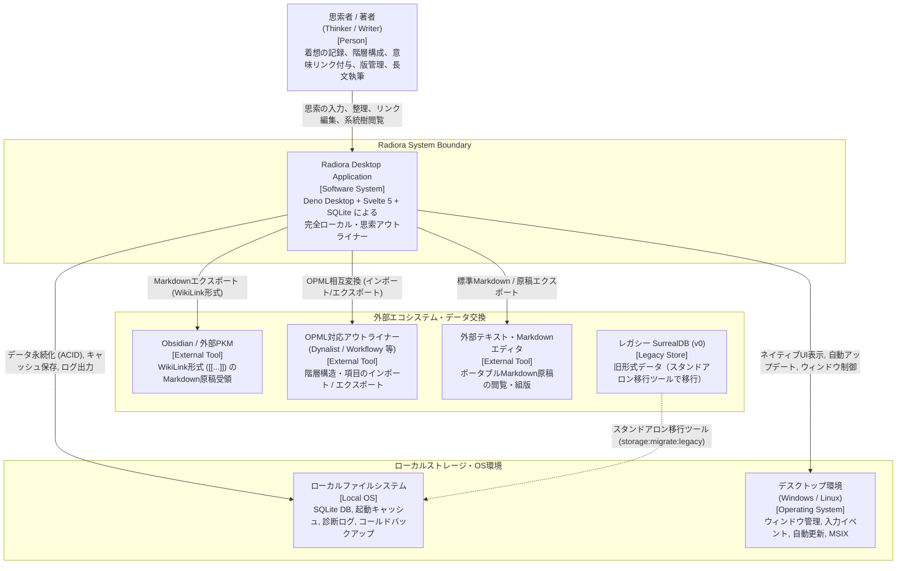
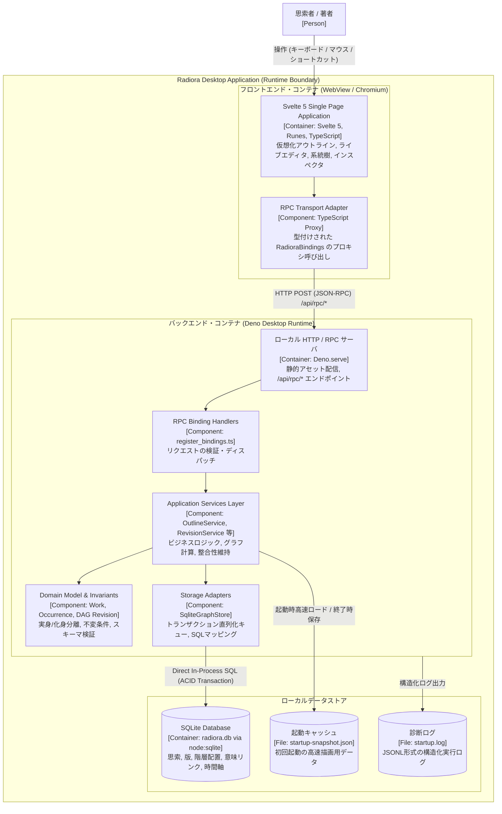
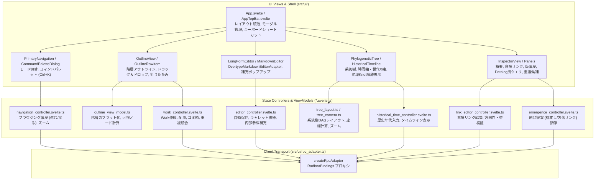
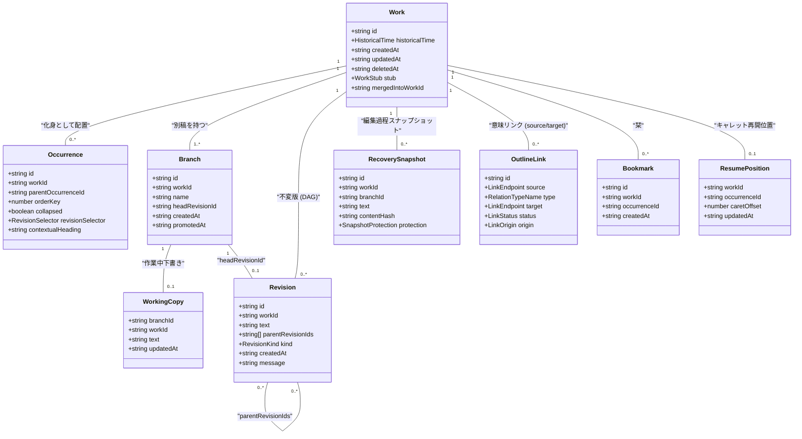

# Radiora v2 アーキテクチャ全景（C4モデル）

本書は、本文主体のアウトライナー **Radiora v2**
の現時点におけるアーキテクチャ全景を、**C4モデル（Context, Container, Component, Code）**
に基づいて可視化・整理したドキュメントです。

---

## 1. システム概要と基本思想

Radiora
は、日々生じる短い着想から長文の稿までを「思索（Work）」として記録し、その仮配置、意味関係、改稿、派生、異本を追跡する**完全ローカル・オフライン動作の思考・執筆環境**です。

### 主要な設計原則

1. **実身（Work）と化身（Occurrence）の分離**:
   同一の思索を複数のアウトライン文脈に複製せず配置可能。
2. **改稿は破壊ではなく分岐（DAG構造）**:
   過去の版（Revision）は不変。別稿（Branch）や複数親の混成稿（Merge）として追跡。
3. **関係を早く決めすぎない**: 暫定的な階層配置と、断定的な型付き意味リンク（`FROM`, `SUPPORT`,
   `VS`, `PART_OF` 等）を分離。
4. **日付・歴史年代は座標**:
   日付ノードを思索の親に強制せず、時間軸・カレンダー座標（HistoricalTime）として扱う。
5. **完全ローカル第一（Local-First）**:
   外部クラウドやネットワークに依存せず、すべてのデータと計算をローカル完結。

---

## 2. Level 1: System Context（システムコンテキスト＆全景）

利用者を起点とし、Radiora Desktop
システムと外部エコシステム（ファイルシステム、連携ツール、OS環境）との境界および関係性を表します。

### システムコンテキストの構成要素

- **思索者 / 著者 (User)**: 日常のメモから論文・書籍の構成までを扱うエンドユーザー。
- **Radiora Desktop Application**:
  思索の階層化、DAG版管理、グラフ関係性計算、歴史年代軸可視化を担う中核システム。
- **ローカルファイルシステム**: `%LOCALAPPDATA%\RadioraV2` 配下の SQLite
  データベース、起動キャッシュ、診断ログ。
- **外部エコシステム**: 組版や共同編集は抱え込まず、Markdown（Radiora形式 / ポータブル形式 /
  Obsidian形式）や OPML で外部ツールと連携。

---

## 3. Level 2: Container（コンテナ図）

Radiora Desktop
アプリケーションを構成する実行単位（プロセス、ランタイム、ストレージ、通信境界）を示します。

### コンテナ間の通信・結合特性

- **Frontend $\leftrightarrow$ Backend**: Deno の組み込み `Deno.serve` を経由したローカル HTTP
  通信。`createRpcAdapter` による TypeScript Proxy
  経由で、完全な型安全性を維持しながら疎結合に通信。
- **Backend $\leftrightarrow$ Database**: Deno 標準の `node:sqlite`
  による同一プロセス内の直接アクセス。`mutationQueue` による Promise
  ベースの直列化でトランザクション競合を排除。
- **起動高速化キャッシュ**: バックエンド起動完了を待つ間、前回セッションの `startup-snapshot.json`
  を先行描画して体感起動速度を極小化。

---

## 4. Level 3: Component（コンポーネント図）

主要コンテナである「Frontend (Svelte 5)」と「Backend (Deno
Desktop)」の内部コンポーネント構成および依存関係です。

### 4.1 Frontend Component Diagram

### 4.2 Backend Component Diagram

```mermaid
flowchart TD
    subgraph TransportLayer ["Desktop & RPC Transport (src/desktop/)"]
        MainEntry["src/main.ts<br>Deno.serve, BrowserWindow, ライフサイクル"]
        RpcDispatch["register_bindings.ts<br>RadioraBindings RPC ディスパッチャ"]
        SnapshotCache["startup_snapshot_cache_file.ts<br>起動スナップショットのJSON入出力"]
        MainEntry --> RpcDispatch
        MainEntry --> SnapshotCache
    end

    subgraph AppServicesLayer ["Application Services (src/services/)"]
        OutlineSvc["OutlineService<br>アウトライン走査, 移動, 子ノード昇格, RuleQuery"]
        RevisionSvc["RevisionService<br>不変Revision生成, 枝分かれ, 混成稿, 差分"]
        BranchSvc["BranchService<br>Branchライフサイクル, 系統投影 (Global / Work)"]
        LinkOps["SemanticLinkOperations / AdvancedLinkResolver<br>意味リンク整合性, 構文解析, 未解決Stub生成"]
        RefSvc["InternalReferenceService<br>内部参照 (radiora://) 解決, バックリンク集計"]
        DupSvc["DuplicateCandidates / WorkMergeService<br>類似度スコア算出, トランザクション統合"]
        EmergenceSvc["EmergenceSuggestionCalculator<br>三角形関係・近傍クラスタ検出, 創発提案"]
        TimeSvc["HistoricalTimeService / DateProjection<br>歴史年代計算, カレンダー変換, 座標投影"]
        PortabilitySvc["MarkdownExport / OpmlService / JsonBackup<br>Markdown/OPML/完全JSONインポート・エクスポート"]
        RecoverySvc["RecoverySnapshotService / WorkingCopyAutosave<br>定期自動スナップショット, クラッシュ復元"]
    end

    subgraph DomainLayer ["Domain Core & Invariants (src/domain/)"]
        DomainModels["models.ts<br>Work, Occurrence, Branch, Revision, Link, Stub"]
        RelationModel["relation_type.ts<br>型定義 (FROM, SUPPORT, VS, PART_OF 等), 対称性"]
        TimeModel["historical_time.ts<br>歴史年代型 (BCE/CE, 不確実性, 精度)"]
        ValidationSchemas["schemas.ts / input_schemas.ts<br>ランタイム検証, 不変条件チェック"]
    end

    subgraph StorageLayer ["Persistence Layer (src/storage/)"]
        StorePort["GraphStore / RelationTypeDefinitionStorePort<br>ストレージ抽象インターフェース"]
        SqliteStore["SqliteGraphStore<br>node:sqlite, トランザクション直列化キュー"]
        SqliteRecords["sqlite_records.ts / sqlite_schema.ts<br>SQLスキーマ, 行マッパー, マイグレーション"]
        MigrationTool["turso_migration.ts / legacy_surreal_exporter.ts<br>SurrealDBからの安全なデータ移行"]
    end

    RpcDispatch --> AppServicesLayer

    OutlineSvc --> DomainModels
    RevisionSvc --> DomainModels
    BranchSvc --> DomainModels
    LinkOps --> RelationModel
    TimeSvc --> TimeModel
    AppServicesLayer --> ValidationSchemas

    AppServicesLayer --> StorePort
    SqliteStore -.->|implements| StorePort
    SqliteStore --> SqliteRecords
    MigrationTool -.-> SqliteStore
```

---

## 5. Level 4: Code & Domain Model（コード・詳細構造）

システムの根幹を支えるドメインエンティティの関連性と、中核設計パターンを示します。

### 5.1 中核エンティティ関連図（ER/Class Diagram）

### 5.2 アーキテクチャ上の主要パターン

1. **実身・化身（Work-Occurrence）モデル**:
   - `Work` は思索の「同一性・本文・版・意味リンク」を保持する。
   - `Occurrence` はアウトライン上の「配置（親ノード参照、並び順 orderKey、見出し上書き
     contextualHeading）」を保持する。
   - 1つの思索が複数の文脈に現れても、本文は単一の実身に紐づき整合性が保たれる。
2. **DAG型版管理（Revision DAG）**:
   - `Revision` は上書きされず、`parentRevisionIds` を複数持てる有向非巡回グラフ（DAG）として記録。
   - 単純な一本道の履歴だけでなく、分岐（Branch）や複数親の混成稿（Merge）をネイティブに表現。
3. **循環参照の隔離（Knot列）**:
   - 意味リンクや `FROM`
     系譜に循環が発生した場合、系統計算を破綻させず自動検出して特殊列（`Knot`）へ隔離投影。
4. **Svelte 5 Runes と State Ownership**:
   - View（`.svelte`）には状態遷移やロジックを書かず、純粋な描画とイベント送出に徹する。
   - 状態所有は各ドメイン単位の Controller（`*.svelte.ts`）に集約し、テスト容易性と保守性を確保。

---

## 6. 品質特性・横断的関心事（Cross-Cutting Concerns）

| 関心事                     | 実装アプローチ・設計上の担保                                                                                                                                                                                                                                     |
| :------------------------- | :--------------------------------------------------------------------------------------------------------------------------------------------------------------------------------------------------------------------------------------------------------------- |
| **オフライン・自律性**     | 完全ローカルファイル永続化（SQLite / JSON）。外部通信不要。                                                                                                                                                                                                      |
| **データ整合性・保護**     | SQLite ACID トランザクション。直列化キュー（`mutationQueue`）。自動回復スナップショット（`RecoverySnapshot`）と保護フラグ。                                                                                                                                      |
| **マイグレーション安全度** | 旧SurrealDBからの移行時は、元DBを変更せずコールドバックアップを作成してからSQLiteへ移行。未移行時は起動を停止して破壊を防止。                                                                                                                                    |
| **起動・描画性能**         | `startup-snapshot.json` によるファストパス描画。アウトラインの仮想スクロールおよびインデックス走査。                                                                                                                                                             |
| **テスト駆動・品質防壁**   | - **単体/結合テスト**: Deno test, Vitest - **UI回帰**: Playwright UI / Visual / a11y - **変異テスト**: Stryker による Controller / Service の網羅度・検出力検証 - **コードメトリクス**: Biome, knip, jscpd (重複検知ラチェット), 実装行数制限ラチェット |
