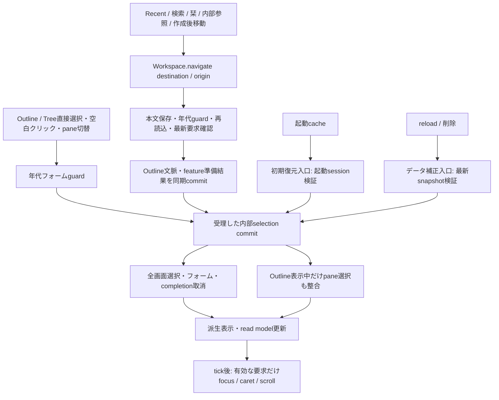
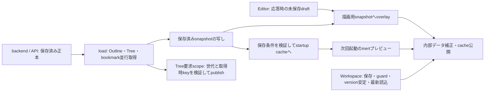

# UI state ownership・writer・寿命

2026-10-04。Issue [#295](https://github.com/asadaame5121/Radiora/issues/295)、親Issue
[#294](https://github.com/asadaame5121/Radiora/issues/294) の実装契約。 照合基点は main
`b208ea0a495ac39c62c78fb833bc6c141a2155cb`（PR #302反映後）。 Issue本文に記録された「Radiora State
Ownership Map / Controller規約案」の要点を現行symbolと照合した。
元のユーザー提供ファイルはリポジトリにないため、その全文との一致は未確認。

本Issueでは文書・契約を確定する。以下の「決定」は後続実装が守る境界であり、
「現状との差」は未実装の移行・回帰検証を表す。状態の移動や動作変更は本Issueで行わない。
Treeの詳細は既存の[Tree所有契約](tree-state-ownership.md)、画面復帰の仕様は
[Outline画面遷移設計](outline-screen-navigation.md)を参照する。

## 用語と共通規約

- **正本**: 保存済みデータはbackend/API。未保存入力は対応featureのdraft。
  描画キャッシュや取得結果を正本としてDBへ書き戻さない。
- **owner**: 状態の格納・不変条件・寿命を持つ一箇所。**writer**: そのownerの操作を通じて
  更新を受理する主体。格納ownerが一つでも、複数featureの変更を確定する責務はWorkspaceに置ける。
- **App寿命**: App生成から破棄まで。画面のunmount/remountでは失わない。 **View寿命**:
  その表示instanceのmountからunmountまで。
- Controllerはfeatureの操作を公開し、Viewは読み取り値とcallbackを使う。
  生のsetterや双方向の`$effect`で複数ownerを同期しない。現在のbindや公開fieldは移行対象として区別する。
- I/Oはfeature-specific portを通す。prepareは結果を保留し、受理後の同期commitで公開する。
  commitの途中に`await`を挟まず、focus/caret/scrollは描画後に要求の有効性を再確認する。
- 要求世代・timer・receiptは描画に不要なら非Rune。古い成功・失敗・finallyが新しい状態を
  変更しない。DBへの完了済み書込はUI要求の失効で巻き戻さない。

## 状態所有表

表のownerは基点の現状を記し、実装済みの移行は当該PR headのowner・操作へ更新する。
mainへの反映状況と照合baseは末尾のIssue別記録で区別する。 「保存なし」はそのUI
state自体を永続化しないという意味で、元データのDB保存とは区別する。

### 保存データ・選択・Outline

| 状態 / 正本                                                         | owner                                                            | writer・公開操作                                                                                                                   | 読み手                                                          | 寿命                               | 永続化先                                                    | 失効条件                                                           |
| ------------------------------------------------------------------- | ---------------------------------------------------------------- | ---------------------------------------------------------------------------------------------------------------------------------- | --------------------------------------------------------------- | ---------------------------------- | ----------------------------------------------------------- | ------------------------------------------------------------------ |
| 保存済みWork/Branch/Revision/Occurrence/Link / backend              | service/storage、UIは`api`経由                                   | 既存mutation API、transaction/rollbackはstorage                                                                                    | 各featureのread model                                           | 保存データの寿命                   | 選択したstorage backend                                     | mutation、削除、backup復元後に再取得                               |
| `snapshot` / API結果にEditor draftを重ねた描画キャッシュ            | `App.svelte`                                                     | `load`、startup cache復元、Workspaceの`publishOutline`、Editorの本文更新                                                           | Outline、Inspector、選択派生値、各Controllerのgetter            | App                                | 自身は保存なし。保存済みの写しだけstartup cacheへ           | reload、navigationの最新読込、起動cacheから正式データへの切替      |
| inline本文draft・save status・`editVersion` / 未保存入力            | `createEditorController`、内部`WorkingCopyAutosaveCoordinator`   | `updateLocalText`、`flushAutosave`、`flushForNavigation`、`retryAutosave`                                                          | MarkdownEditor、WorkingCopySaveStatus、reload、Workspace        | App。保存成功までdraft保持         | `updateItemText`経由のbranch working copy                   | 同branchの新入力でversion更新。失敗・選択変更・reloadで捨てない    |
| 全画面の`selectedId` / 受理された現在選択                           | `App.svelte`                                                     | 内部publish一箇所。下の旧writer表と#298のcommit契約を参照                                                                          | selectedItem、Inspector、Tree、Editor、commands                 | App                                | 直接保存なし。Outline位置のみstartup cache/resume API       | 受理した選択変更、削除補正、初期復元                               |
| paneごとの選択・Hoist・history/index・active pane / Outline閲覧位置 | `createNavigationController`の`browsing`                         | `browseToOccurrence`、`setHoist`、`clearHoist`、`activateBrowsingPane`、`resetBrowsing`、`reconcileBrowsing`、内部`commitBrowsing` | Outline projection、breadcrumb、Viewport、復帰捕捉              | App                                | startup cacheには現在の選択/Hoistのみ。pane全体の保存なし   | 削除時に各paneの現在位置を補正。画面外選択では更新しない           |
| Outline filter / live表示条件                                       | `OutlineDisplayController.liveFilter`（読み取りは`filter`）      | View入力・Workspace復元から`setFilter`、明示解除から`clearFilter`                                                                  | Today・Unplacedの共有filter UI、復帰捕捉                        | App                                | 保存なし                                                    | 明示filter変更/clear、Outline復帰apply                             |
| 一時展開 / live表示例外                                             | `OutlineDisplayController.liveExpanded`（読み取りは`expanded`）  | hoistから`expand`、選択/pane/復帰から`setExpanded`、collapseから`clearExpansion`、keyboardのclearから`setExpanded([])`             | `OutlineDisplayController.visibleRows`、選択Workspace、復帰捕捉 | App                                | 保存なし。保存済み`collapsed`は別途API                      | 明示clear/collapse、対象削除の復帰補正                             |
| Inspector表示・tab / live表示状態                                   | Appの`inspectorCollapsed` / `asideMode`                          | ユーザー操作、関係編集表示、Outline復帰apply                                                                                       | Inspector、shell、復帰捕捉                                      | App                                | collapsedのユーザー設定だけlayout preference。tabは保存なし | 明示操作、復帰時の文脈適用                                         |
| 原稿本文・dirty・preview・mode / 原稿入力                           | `LongFormController.state`                                       | `input`、`save`、`reset`、内部`setMode`                                                                                            | LongFormEditor、Workspace、復帰捕捉                             | App。画面移動前に保存              | `updateItemText`。mode/previewは保存なし                    | 明示破棄、保存後close。保存中の追加入力は保持                      |
| Outline復帰文脈 / 離脱時のUI位置の写し                              | Workspace内部`OutlineScreenState.suspended`                      | `capture`→受理した離脱で`remember`、`prepare`→commitで`apply`                                                                      | Workspaceだけ                                                   | App。次の受理したOutline離脱で置換 | 保存なし                                                    | 最新snapshotで選択/Hoist/展開IDを補正。本文・DBを巻き戻さない      |
| caret・selection方向・pane/editor scroll・focus / DOM位置           | `OutlineViewportAdapter`、明示編集復帰は`EditorReturnController` | `track`、`capture`、`restore`、`remember` / `restore`                                                                              | Outline復帰、keyboard workspace                                 | adapterはApp、実DOMはView          | resume APIはoccurrence/caretのみ。scroll等の保存なし        | 対象削除、本文短縮、新要求。DOM参照を復帰文脈に保持しない          |
| pending empty occurrence IDs / 作成後の仮置き記録                   | `createPendingEmptyItemController`                               | `track`、`noteTextChange`、`forget`、`discard` / `discardRestored`                                                                 | Outline操作、startup                                            | App＋次の起動までの記録            | `radiora.pendingEmptyItemIds`                               | flush後に空/子なしを再確認。本文入力でforget。削除失敗で記録を残す |

### 画面遷移・Tree・閲覧入力

| 状態 / 正本                                                               | owner                                                                      | writer・公開操作                                                                   | 読み手                                      | 寿命                   | 永続化先                                   | 失効条件                                                                     |
| ------------------------------------------------------------------------- | -------------------------------------------------------------------------- | ---------------------------------------------------------------------------------- | ------------------------------------------- | ---------------------- | ------------------------------------------ | ---------------------------------------------------------------------------- |
| view・pending view・request・origin receipt / 受理済み画面と移動要求      | `ScreenNavigationController`、複数ownerの調停は`ScreenNavigationWorkspace` | `navigate(destination, origin)`、`goBack`。準備結果のcommitは内部のみ              | App、TopBar、feature navigation ports       | App                    | 保存なし。`recordViewChange`は記録I/O      | 新要求は旧要求を失効。開始/受理のreceipt更新で遅いdomain操作の自動移動を抑止 |
| Tree projection preference / 表示設定                                     | `TreeController`                                                           | `setProjection`だけ                                                                | Options→App→GlobalLineage→PhylogeneticTree  | App                    | `radiora.treeProjection`                   | 次の明示変更。View remountで再所有しない                                     |
| Tree filter preference / 表示設定                                         | `TreeController`                                                           | `setFilter` / `reconcileRelations`だけ                                             | Tree filter pane、取得要求                  | App                    | `radiora.treeFilter`。選択例外は保存しない | 明示変更、startup/関係型変更/JSON復元のcatalogue補正                         |
| 選択WorkのTree表示例外 / 現在選択からの派生値                             | `TreeController.activeFilter()`                                            | writerなし。`selectedWorkId` portを読む                                            | 取得filterとfilter key                      | 要求時に派生           | 保存なし                                   | 選択変更。選択stateの複製を作らない                                          |
| Tree結果・error・loading・世代・loaded key / API read model               | `TreeController`                                                           | `prepareRefresh` / `refresh`、要求内`publish` / `cancel`、`invalidate` / `dispose` | Tree、TreeRequestStatus                     | App                    | 保存なし                                   | 世代＋取得時keyの不一致、effect cleanup、dispose                             |
| camera・hover・寸法 / View操作値                                          | `PhylogeneticTree`                                                         | View操作、`connectTreePointer`からのcallback、投影変更後fit                        | Tree描画・hit判定                           | View                   | 保存なし                                   | unmountでobserver/listener/gesture/予約fitを解放                             |
| cluster inspection・sidebar tab / View表示状態                            | `GlobalLineage`                                                            | View callback、消えたclusterを解放するeffect                                       | Tree sidebar                                | View                   | 保存なし                                   | unmount、filterでclusterが消滅                                               |
| OmniWindow入力 / 検索とquick captureで共有する未保存文字列                | `NavigationController.quickCaptureText`                                    | 現状setter→`queueSearch`、`clearOmniwindow`                                        | AppTopBar、検索、WorkControllerへの操作引数 | App                    | 保存なし。作成成功でWorkをAPI保存          | 入力変更、Escape、受理した検索移動/作成成功でclear                           |
| suggestions・results・active index・debounce・search世代 / 検索read model | `NavigationController`                                                     | `queueSearch`、`moveSearchActiveIndex`、`clearOmniwindow`                          | OmniWindow                                  | App内の検索session     | 保存なし。`recordSearch`は別の記録I/O      | 次のquery/clearで世代更新とtimer解除                                         |
| Palette open/query / コマンド入力                                         | `NavigationController`                                                     | `openCommandPalette`、`closeCommandPalette`、現状query bind                        | CommandPaletteDialog、keyboard blocking     | App。open時query reset | 保存なし                                   | close、次のopen。OmniWindow文字列をclearしない                               |
| quick capture submitting / 作成操作状態                                   | `createWorkController`                                                     | `performQuickCapture`                                                              | AppTopBar、commands                         | App内の操作            | 保存なし                                   | 操作完了/失敗。移動のorigin失効とDB作成完了を区別                            |

### Editor周辺・設定・短命UI

| 状態 / 正本                                                               | owner                                                                                      | writer・公開操作                                                                         | 読み手                                            | 寿命                                    | 永続化先                                                              | 失効条件                                                                 |
| ------------------------------------------------------------------------- | ------------------------------------------------------------------------------------------ | ---------------------------------------------------------------------------------------- | ------------------------------------------------- | --------------------------------------- | --------------------------------------------------------------------- | ------------------------------------------------------------------------ |
| 補完候補・trigger範囲・phase・active index・要求世代 / 入力に対応した候補 | Editor内部`createEditorCompletionController`                                               | update/search/choose/apply/commit、`clearCompletions`                                    | InternalReferenceCompletion、InlineLinkCompletion | App内の入力session                      | 候補は保存なし。確定LinkだけAPI                                       | query/trigger範囲/選択変更、cancel、reload。確定前にtextarea範囲を再検証 |
| backlinks・notice・取得世代 / API read model                              | `createEditorController`                                                                   | `loadInternalReferenceBacklinks`、`clearBacklinks`                                       | Inspectorと参照UI                                 | App                                     | 保存なし                                                              | 選択Work変更/clearで再要求・世代更新。古い成功/失敗を捨てる              |
| resume保存queue/version / 最後の編集位置                                  | Editor内部`ResumePositionAutosaveCoordinator`                                              | `updateEditorSelection` / 本文入力→queue、`flushResume`                                  | resume操作、startup補助                           | App                                     | `saveResumePosition` API                                              | 新位置でversion更新。失敗時は未保存位置を保持                            |
| 年代フォームdraft/baseline/error/submitting/pending / フォーム入力        | `HistoricalTimeController`                                                                 | `select` / `canSelect`、`commitSelection`、`save`、`resolvePending` / `cancelPending`    | HistoricalTimeEditor、selection guard、dialog     | App                                     | 受理した`save`だけWorkのhistoricalTime API                            | 同Workの配置変更でdirty保持。別Work変更はguard。新guardで旧pending取消   |
| revisions / recovery / work lineage・loading・各世代 / API read model     | `HistoryController`                                                                        | `loadRevisions` / `loadRecoverySnapshots` / `loadWorkLineage`、`clear` / `clearRecovery` | InspectorHistoryTab、WorkLineage、比較            | App                                     | 保存なし                                                              | 要求世代＋selected Work/Branch不一致、clear                              |
| 比較・日付投影・各Work list・タグ / 各featureのread modelと入力           | `ComparisonController`、`DateProjectionController`、`WorkListState`、`TagController`       | featureの`prepareScreen`→Workspace内部publish。入力/通常refreshは各feature操作           | 各画面                                            | App                                     | 取得結果/日付入力は保存なし。タグmutationだけAPI                      | navigation世代不一致で準備結果を破棄。直接refreshの競合は別途棚卸し      |
| 関係型catalogue / backend設定のread model                                 | `RelationTypeController`                                                                   | `load` / `create`                                                                        | Tree/Editor/Options                               | App                                     | 対応API                                                               | catalogue変更後再取得。Tree補正は`tree.reconcileRelations`へ委譲         |
| Query入力/結果/一時投影、検索alias編集 / 休止中feature                    | `RuleQueryController`、`SearchAliasController`の実装を保持。Appにはinstanceなし            | 旧load/execute/save/remove操作は単体テスト用に残す                                       | 旧InspectorQueryPanelはUI未接続                   | 現行Appのlive stateなし                 | saved query / alias APIは保持。一時投影は保存なし                     | #236の非推奨化に従い再導入の仕様判断まで休止                             |
| Link editor入力 / 編集session                                             | View生成の`LinkEditorController`                                                           | `reset`、`scheduleSearch`、確定/削除/反転の操作                                          | LinkEditor                                        | View                                    | 確定LinkだけAPI                                                       | 選択Work変更でreset、unmountで`destroy`がtimer解除と検索世代更新         |
| emergence候補・reason入力・toast / API read modelと操作session            | App生成の`createEmergenceController`                                                       | `load` / `clear`、`resolve`、`dismissToast`                                              | 候補UI、Toast                                     | App                                     | 候補解決だけAPI。toastは保存なし                                      | 選択変更・新取得・clearで取得世代更新。汎用storeへ移さない               |
| theme / ユーザー設定                                                      | `createThemeController`                                                                    | `setPreference`だけ                                                                      | ThemeSwitcher、document                           | App                                     | `radiora.themePreference`                                             | 明示変更。`init` cleanupでsystem theme listener解除                      |
| layout preference / ユーザー設定                                          | 現状Appのnav/collapsed/width、writerは`persistUiLayoutPreference`                          | toggle、Options callback、resize終了                                                     | shell、Options、Inspector                         | App＋再起動                             | `radiora.uiLayoutPreference`                                          | 不正保存値は検証/fallback。復帰文脈適用は永続化の権限を持たない          |
| export / quick capture preference / ユーザー設定                          | Appの`markdownExportPreference` / `quickCapturePreference`                                 | `persistMarkdownExportPreference` / `persistQuickCapturePreference`だけ                  | Options、export、Work作成                         | App＋再起動                             | `radiora.markdownExportPreference` / `radiora.quickCapturePreference` | 明示設定変更、不正値fallback。入力本文やnoticeは含めない                 |
| startup phase/cache active/data loaded / 起動状態                         | 現状App、#300で既存StartupControllerへ移行                                                 | poll、retry、cache restore、`loadStartupData`                                            | StartupView/StartupCacheStatus、操作blocking      | Appの起動session                        | phase自体は保存なし。cacheは専用API                                   | 正式load成功、retryで前session失効、dispose                              |
| bookmarks / API read model                                                | 現状Appの`bookmarks`                                                                       | `load`、add/remove後の再読込、WorkControllerのreloadBookmarks port                       | TopBar/Inspector/menu                             | App                                     | bookmark API。配列自身の保存なし                                      | mutation後再読込。現在はreload全体の世代保護なし                         |
| confirmation・keyboard chord・menu・modal・notice / 操作session           | `ConfirmationController`、`KeyboardController`、Appのcontext menu/licences/notices、各View | request/submit/finish/reset、keyboard cancel、open/close、対応操作                       | dialog、Toast、shell                              | 表示/操作session。Controllerの格納はApp | 保存なし                                                              | close/完了/失敗/対象変更。DOM listenerやtimerは接続ownerが解放           |

## 選択writerとcommitの権限

決定: `selectedId`の格納はAppの一箇所に維持する。#298では既存commit境界を
`OccurrenceSelectionWorkspace`へ集約した。独立SelectionControllerや選択stateの写しは追加しない。
Viewやdomain操作へ無条件のsetterを公開しない。
ユーザー要求、Workspace内部commit、初期復元、データ補正は権限を分ける。

Outline表示中、受理したcommitの完了時には
`selectedId === currentBrowsingLocation(browsing).selectedOccurrenceId`を満たす。
HoistはOutlineの閲覧範囲であり、現在のWorkから勝手に導出しない。
別画面では`selectedId`だけ変更でき、paneの閲覧位置と`suspended`は独立して保持する。
Inspector/Tree/履歴/backlinksは受理した全画面選択から派生・取得し、選択のwriterにはしない。

| #295基点の直接writer（すべて`App.svelte`）            | 種類・guard                                                                    | 決定した更新権限 / #298の整理                                                                                                     |
| ----------------------------------------------------- | ------------------------------------------------------------------------------ | --------------------------------------------------------------------------------------------------------------------------------- |
| `commitOccurrenceSelection`（`selectOccurrence`経由） | Outline/Treeの直接選択、空白クリック。`HistoricalTimeController.select`でguard | 受理後だけcompletion取消→選択＋Outline active pane更新。別画面ではpaneを書かない。afterSelection/focusは受理後                    |
| ScreenNavigationの`selection.commit` port             | `navigate`の保存・guard・最新要求確認済み内部commit                            | フォームと全画面選択を同期確定。Outlineでは先に`OutlineScreenState.apply`が準備済みpaneを適用。二度browseして履歴を追加しない     |
| `restoreStartupSnapshotCache`→`resetBrowsing`         | 初期復元。通常のユーザーguardを省略                                            | 初期Outlineが未操作・正式load未完了・同じ起動sessionのときだけsnapshot＋閲覧位置＋選択を復元。以後の選択をcacheで上書きしない     |
| `load`→`reconcileBrowsing` / 存在しないIDをnull       | データ補正。ユーザー移動ではない                                               | 同じ選択を維持し、削除済みID/Hoistだけ補正。Outlineではpaneと同じcommit。別画面では現在選択だけ補正。任意の別項目を選ぶ権限はない |
| `switchBrowsingPane`→`activateBrowsingPane`           | pane切替。年代フォームguardあり                                                | pane存在を検証し、受理後にactive pane・補正済み選択・一時展開を同時更新。completion取消と描画後のcurrent確認を統一                |
| selectedItemを読む年代フォーム同期`$effect`           | snapshot/直接代入を追いかけ、拒否時に旧フォームIDへ戻す                        | 現状の暫定修復。新しい相互同期を追加せず、各commitのフォーム適用/補正へ収束させる。effectを正式writerとして残さない               |

復元は初期状態を設定する内部操作、削除補正は不存在を反映する内部操作であり、
未保存入力を破棄する許可ではない。dirtyな年代フォームがある場合、別Workへのユーザー選択は Save /
Discard / Cancelで調停する。削除補正では存在しないIDを旧フォームから復活させず、
フォームdraftはHistoricalTime ownerに残し、保存先の不存在による失敗を表示できる状態にする。
この補正と従来の同期effectの衝突は#298の回帰テストで固定し、effectを削除した。

### #298で適用した選択境界

実装基点: main `4912cf2`（PR #303反映後）。Appの`selectedId`は引き続き唯一のRuneであり、
代入は`OccurrenceSelectionWorkspace`の内部`publish` port一箇所だけに限定する。
選択・フォーム・paneという複数ownerの同期commitと要求の失効を、Viewから独立して検証するため
Workspaceを設けた。snapshot、Editor draft、live filter/Inspector、履歴の取得は移さない。

| 入口             | 権限・順序                                                                                                                                                                                                  |
| ---------------- | ----------------------------------------------------------------------------------------------------------------------------------------------------------------------------------------------------------- |
| `select`         | Outline/Tree/空白のユーザー要求。画面遷移と旧guardを失効させ、年代guard後に最新snapshotで対象を再確認。completion取消→pane/全画面選択→フォームを同期commitし、受理後だけcallbackを呼ぶ                      |
| `switchPane`     | 存在するpaneへのユーザー要求。guard後に最新snapshotでpane位置を補正し、pane・選択・一時展開・フォームを同時commit。completion取消後に有効な要求だけcaret/scrollを復元                                       |
| `commitPrepared` | `ScreenNavigationWorkspace`の内部権限。保存・guard・最新要求確認済みの結果を同期commitする。先に適用済みのOutline文脈を再browseせず、historyを二重追加しない                                                |
| `restoreInitial` | 未操作かつ未破棄の起動sessionだけが持つ復元権限。Appのcancelled/正式load/Editor・原稿draft条件と、Workspaceの要求履歴・年代draft条件を確認。snapshot・pane位置・選択・フォームをまとめて初期化              |
| `reconcile`      | reloadが公開したsnapshotに対する内部補正。ユーザーguardを開かず不存在のID/Hoist/一時展開を除去し、任意の別項目は選ばない。dirty/submittingの年代フォームはそのownerへ残す。別画面では休止中paneを変更しない |
| `setHoist`       | Outlineの範囲変更。全画面選択を動かさずactive paneの選択を維持し、準備中の旧遷移/guardを失効させる                                                                                                          |

年代フォームを追いかけて選択を戻す`$effect`は削除した。削除補正で選択をnullにしても、
未保存の年代draftと元Workへの保存先はフォームに残す。保存先が消えている場合は通常の保存失敗を表示し、
そのdraftから選択IDを復活させない。保存中の追加入力も保持し、新しいdraftが残れば移動承認は保留する。
画面遷移の最終read中に年代入力が追加された場合も、公開前に改めてguardを通す。

初期復元ではAppが起動sessionとEditor/原稿draftの復元許可を渡し、選択Workspaceが
自身の要求履歴と調停対象の年代フォームを保護する。各条件のstate ownerは一意であり、
Workspaceへ全featureのdraftを取り込まない。起動sessionの調停は#300のStartup抽出に引き継ぐ。
内部commitのモードは`selection` / `correction`で明示し、後者だけdraftを捨てない補正を行う。
年代draftの等値性は既存のdirty baselineと同じJSON比較を使う。draftは固定キーの
string/booleanのオブジェクトで、生成後は各fieldを編集するため、この範囲では比較結果が安定する。

Inspector・履歴・backlinks・Treeのread model更新は受理した`selectedItem`から既存effectで行う。
focus/caret/scrollには選択要求のreceiptと画面遷移のcurrent判定を使い、A→B→Aでも古い復元は行わない。
既に選択済みの行へのDOM focusは新たなユーザー要求として再送せず、復帰中のscroll復元を失効させない。
App破棄時は両Workspaceの要求と年代guardを失効させる。

回帰テスト: [選択Workspace](../../vitest/occurrence_selection_workspace.test.ts)、
[選択と画面遷移の競合](../../vitest/selection_navigation.svelte.test.ts)、
[年代フォーム](../../vitest/historical_time_controller.svelte.test.ts)、
[画面UI](../../tests/ui/screen-navigation.spec.ts)。 通常reload全体の要求世代・branch別draft
overlayとstartup pollingの失効は、引き続き後続作業とする。

## snapshot・draft・reload・startupの更新手順

決定: 通常reloadの調停はOutline描画キャッシュの境界に置き、Startupへ吸収しない。
Startupは起動sessionの進行を所有し、snapshot/選択の内部復元操作と通常loadを呼ぶだけ。 Editor
draft、theme、keyboard、visibility/unload flushをStartupの状態へ移さない。

現状の`App.load`は次の順序で更新する。

1. `tree.prepareRefresh()`で取得時filter/key/世代を捕捉し、`listOutline`・Tree・`listBookmarks`を並行取得。
2. 全取得成功後、draftを重ねる前の`next.items`等を`snapshotForStartupCache`の写しとして保持。
3. **応答到着時**の`editorController.drafts()`を読み、未保存本文を描画用`next.items`へ反映して`snapshot`を公開。
4. completionを取消し、Outlineの閲覧位置または別画面の不存在選択を補正。
5. Tree要求の`publish()`、bookmarks公開、必要ならguard付き`selectOccurrence(focusId)`。
6. 保存条件を満たす場合だけ保存済みsnapshotをcache
   APIへ渡す。失敗時はTree要求の`cancel()`、error表示。

draftの所有はbranch単位のautosave coordinatorにあり、通常入力の`applyBranchWorkingCopyText`は
同Work・同branchの配置だけ変更し、pinned Revisionを変更しない。 一方、現状reloadのoverlayはWork
IDだけのMapで、branchやpinnedを区別しない。
これを望ましい仕様として固定しない。branchに対応したoverlayと競合制御は#294の
「Outline描画キャッシュの通常reload」後続作業に残す。#298/#299/#300の抽出で
draftを捨てたり、別branch/pinnedへの誤反映を広げたりしない。

Workspaceの`publishOutline`は通常loadを呼ばず、選択遷移のcommit内でcacheを置換する。
`prepare`で原稿保存・inline flush、年代guard、feature prepareを行い、`finishPreparation`で editor
versionが安定するまで保存・flush・`readOutline`を繰り返す。
guard中/最後の読込中に入った入力を保存し直し、最新snapshotと遷移先を同期公開する。
保存失敗や読込失敗では画面/選択/復帰文脈を公開せず、draftはEditorに残す。

startup cacheは読み取り専用の起動プレビューであり、backendの正本へ昇格させない。
cache表示中はshellをinertにし、正式データのload→復元した空項目の処理が成功した後に
`startupDataLoaded = true` / `startupCacheActive = false`とする。
cache保存の入口は`persistStartupSnapshotCache`だけで、cache表示中・起動未ready・
inline未保存draftありなら書かない。原稿dirtyも保存済みcacheとして扱わないことを維持する
（原稿本文は現状snapshotに直接重ねていない）。cache保存失敗は編集を止めない。

現状との差: `load`にはOutline/bookmark共通の要求世代がなく、Tree世代だけでは
古いreloadのsnapshot/error/finally公開を防げない。Workspaceの遷移世代とも共通ではない。 startup
pollはawait後のcancelled再確認がなく、retryとmonitorの全応答を失効させる世代もない。
#300で起動sessionの失効を適合させ、通常reloadとの競合はキャッシュ境界の後続作業で扱う。
抽出しただけでこれらが解消済みと記録しない。

## #299: Outline編集操作の現行適合

main `5240c44`（PR #304で#298反映済み）をbaseに、 `codex/issue-299-outline-operations`でPR
#274のControllerと8件の直接テストを再利用した。 PR
#274のmerge基点は`a4aa5044b57b330a4daadd166c11889f5cbf3a00`。
このbranch上での実装・検証と、mainへのmergeは区別する。

- `OutlineOperationsController`はindent/outdent、兄弟移動、collapse、行分割、空行削除と
  構造編集キーを担当する。AppはIME/completionを先に処理し、その後に行keydownを委譲する。
  root作成、通常Occurrence削除、drag、全件collapseは既存の入口に残す。
- snapshot/selectedIdはApp、本文draftとautosaveはEditor、空項目記録はpending empty、
  選択commitは`OccurrenceSelectionWorkspace`のownerを維持する。Controllerに写しを持たない。
- 分割はautosave完了→応答時のcaret/selection読取→本文更新→Occurrence作成→空ならtrack→reload。
  空Backspaceはautosave完了→削除→forget→reload。保存・作成・削除失敗では未完了の後続処理を行わない。
- 操作開始時に選択receiptと画面originを捕捉する。操作中の選択/pane/画面変更で失効した要求は、
  完了済みDB書込とpending記録を保持し、reload後の選択/focusを戻さない。
  `load`は選択削除補正の直前に有効性を確認する。自操作による補正で失効するreceiptを、
  古いユーザー操作と混同しない。受理した選択後のfocusは既存の最新receiptで再確認する。
- autosave失敗は既存のnull/false契約を保持。構造書込の失敗は元の原因をcallerへ伝え、
  キーイベントと行clickはrejectionを処理する。旧要求の失敗で新しいerrorを上書きしない。
  collapseのコマンド経路では従来どおり失敗がコマンド処理へ伝わる。

これは編集操作由来の選択/focusの適合であり、通常reload全体のsnapshot/bookmark/error/finallyの
要求世代、遷移との公開競合、Work-only draft overlayは未解決。#294のcache後続へ残す。 startup
sessionの#300も含めない。

回帰: PR #274の8件に、保存順序・失敗時保持・修飾キー/IME・キー委譲・失効した要求のテストを追加。
`tests/ui/outline-operations.spec.ts`で作成待ち/読込待ちの選択変更、画面変更、
空Backspaceのpending記録と前行focusを検証する。

## live state・復帰文脈・pane履歴

決定: Outline filter/一時展開は`OutlineDisplayController`のlive state、InspectorはApp、
原稿はLongForm、pane閲覧位置はNavigationが所有する（#308 head）。
今後もこの変更理由ごとにownerを分ける。
`OutlineScreenState`は捕捉・保持・補正・復元する**文脈のowner**であり、 live
state全体を常時集約するstoreにはしない。復帰文脈には保存済み本文やinline draftを入れない。

画面の「戻る」は常に保持したOutlineへの復帰で、Outline上では無効。
Outline→Tree→Helpからも元のOutlineへ戻る。明示occurrenceへの移動はsaved Hoistの
内外を判定して閲覧位置を更新する。単なる画面外選択は復帰位置を更新しない。

paneの`history` / `historyIndex`は既存データ構造。選択/Hoistで`pushLocation`が追加し、
`reconcileBrowsingState`は各paneの**現在entryだけ**削除補正する。 `moveBrowsingHistory` /
`canMoveBrowsingHistory`は純粋関数として存在するが、
現行NavigationControllerには戻る/進む公開操作がなく、Appのpane追加/切替もUI未接続の保持経路。
pane履歴UI、画面履歴stack、Browser History接続は本Issueおよび#298で追加しない。
過去entryの再補正やpane履歴の提供は将来の仕様判断として別扱いにする。

## Navigationに同居する変更理由

決定: browsing、OmniWindow、Palette、quick captureの実行は別featureとして分離候補にする。
現状の`NavigationController`という同じ格納先を、全ナビゲーションの恒久ownerという意味にしない。

- browsingはpane位置とHoistの不変条件を持ち、検索queryやPalette開閉には依存しない。
- OmniWindowの`quickCaptureText`は検索と作成で**一つの共有入力**。
  分離後も入力ownerを一つに保ち、検索候補とWork作成は値を読む。
  WorkControllerは作成/submittingを所有し、入力stateを複製しない。 現状の作成成功callback
  `clearQuickCaptureInput`と検索移動受理後/Escapeのclear経路を維持する。
- Palette queryはOmniWindow入力とは別。開いたときだけresetし、閉じても検索入力に書かない。
  フォーカス復元先はAppの`commandPaletteRestoreFocus`/DOM adapter側に置く。
- debounce timerとsearch世代は検索owner。現在は`queueSearch` / `clearOmniwindow`が解除し、 App
  unmount時のdispose接続がない。将来分離時に解除と応答失効を追加する。
  選択IDは検索実行時に読み、現状は選択変更だけで再検索/失効しない。この文脈検索の方針は別途決める。

この分離とコマンド実行の二重実行防止、Palette focus、global key adapterは#294の後続候補。
#295で巨大な共通storeを新設したり、setterを追加して配線したりしない。

## 設定writerとInspectorの永続化

決定: storage helperは検証・fallback・保存I/Oのadapterであり、状態ownerではない。
各設定につき所有表に記したwriterだけが呼ぶ。Viewのmountで再読込/保存するownerを作らない。
Treeの設定はPR #302でこの契約を実装済み。OptionsとTreeはprops/callbackで同じ値を共有する。

Inspectorの永続ユーザー設定とOutline復帰中のcollapsedは値の用途を区別する。
ユーザーのtoggle/Options変更/resize終了だけlayout設定を永続化し、
`OutlineScreenState.apply`やQuery表示の一時openは保存しない。tabは永続化しない。
後のwidth/nav変更でも一時collapsedを設定へ混入させず、最後の明示ユーザー設定を使う。

現状はrestore portがcollapsedを直接代入し、保存は`persistUiLayoutPreference`で live
nav/collapsed/widthをまとめるため、その後のresize/nav保存に復帰値が混入し得る。
恒久設定とlive表示値の分離はLayout ownerの後続作業（#294）で実現する。 `asideMode`はView
callbackと関係編集/Queryで変わるが、Outline文脈の復元とは別の明示操作。
この差を「全layout変化を保存するeffect」で解消しない。 なおQueryへのdestination/aside
mode互換値は残るが、現行Inspectorは`query`をoverviewへ表示補正する。
[Query非推奨化](query-deprecation.md)に従い、Query/検索aliasのlive ownerをAppへ再接続しない。

## 非同期の前提・取消・cleanup

以下は保持/移行する契約と、現状で足りない接続を区別した一覧。
取消はUI公開の失効であり、APIの物理abortがあるとは限らない。

| 境界                            | 公開前に確認する前提                                                    | 取消・破棄時の契約 / 現状との差                                                                                                                                                                                                             |
| ------------------------------- | ----------------------------------------------------------------------- | ------------------------------------------------------------------------------------------------------------------------------------------------------------------------------------------------------------------------------------------- |
| Screen navigation               | request世代、起点selectedId、editor version、domain操作のorigin receipt | 新要求でpending guard取消。古いfinallyは新pendingを消さない。描画後currentも確認。現状dispose APIはなく、App破棄時のpending取消接続は後続候補                                                                                               |
| Tree refresh / staged reload    | 世代＋取得時filter key＋未dispose                                       | `invalidate` / request `cancel` / `dispose`。Tree退出effect cleanup、App unmountでdispose。古いcancelは最新要求を取消さない。loadingはAPI完了後もpublish/cancelまで維持                                                                     |
| Editor autosave                 | branchごとのversion/savedVersion、捕捉したoccurrence/text               | branchごとに直列化。flushでdebounce timer解除。失敗はdraft/statusを保持しretry。View unmountでdraftを捨てない。App teardownでflushはbest effort                                                                                             |
| Completion                      | 要求世代、取得開始時選択、itemId/phase、確定時trigger範囲と文字列       | cancel/clearで世代更新。Link DB書込完了後は対応する元triggerだけ処理し、古い要求から現在focusを奪わない                                                                                                                                     |
| Backlinks / History / emergence | 各要求世代、HistoryはWork/Branch、emergenceは選択ID                     | 選択effectからload/clear。backlinksはclearで世代更新、別Work loadで新要求。現状これらにApp dispose一括接続はない                                                                                                                            |
| OmniWindow search               | query要求世代（選択文脈は現状失効条件に含まない）                       | 新query/clearでtimer解除と世代更新。unmount disposeは分離時の残作業                                                                                                                                                                         |
| Startup                         | 起動session世代、未dispose、正式load未完了、復元権限                    | #300でpoll/retry/cacheの各await後に再確認。timer解除・応答失効。現状cancelledはloop入口/cache応答のみで全await後を覆わない                                                                                                                  |
| 通常reload                      | 描画cache要求の有効性、応答時の最新draft、現在画面/選択                 | Tree以外の世代制御は未実装。選択commitやstartupと競合する公開順はcache後続作業で固定                                                                                                                                                        |
| DOM adapters / resize / focus   | mount状態、対象ID、pane、navigationのcurrent                            | View/adapterがobserver/listener/gestureを解放。OutlineViewport.connectはfocusin cleanup、Theme.initはmedia listener cleanup。AppのInspector resizeはpointerup cleanupのみ、requestFocusはIDのみ確認でtimer未取消。後続Layout/選択作業で補う |

Appのvisibility hidden/unloadは本文とresumeのflushを呼ぶ副作用境界。 teardownはawaitできないためbest
effortとし、通常操作の保存失敗を成功扱いにしない。
各`$effect`には目的・追跡する値・cleanupを記載し、port内の読み書きは必要なら`untrack`で
分離する。Treeのresult/error/loadingや履歴の取得結果を書いて取得effectを再発火させない。

## 後続Issue・回帰シナリオ・対象テスト

以下のテストは既存契約の根拠。未実装のシナリオは「追加」と記し、既に検証済みと扱わない。

| 作業                               | 参照する契約・回帰シナリオ                                                                                                                                                                          | 対象テスト                                                                                                                                                                                                                                                                                                                                                                                                                                                                                                                  |
| ---------------------------------- | --------------------------------------------------------------------------------------------------------------------------------------------------------------------------------------------------- | --------------------------------------------------------------------------------------------------------------------------------------------------------------------------------------------------------------------------------------------------------------------------------------------------------------------------------------------------------------------------------------------------------------------------------------------------------------------------------------------------------------------------- |
| #296（PR #302でmain反映済み）      | projection唯一writer、Tree↔Options、remount/再起動、保存失敗、更新layoutへのfit                                                                                                                     | [Tree Controller](../../vitest/tree_controller.svelte.test.ts)、[preference](../../tests/tree_projection_preference_test.ts)、[Tree UI](../../tests/ui/tree-interaction.spec.ts)、[Options契約](../../tests/options_ui_contract_test.ts)                                                                                                                                                                                                                                                                                    |
| #297（PR #302でmain反映済み）      | filter A→B逆順、古い失敗、選択例外非永続化、退出/dispose、reload保留公開/取消、startup/catalogue/backup補正、retry                                                                                  | [Tree Controller](../../vitest/tree_controller.svelte.test.ts)、[Tree UI](../../tests/ui/tree-interaction.spec.ts)、[lineage契約](../../tests/lineage_views_contract_test.ts)                                                                                                                                                                                                                                                                                                                                               |
| #298（本branchで実装、main未反映） | 6writer収束、直接選択/Tree/空白/pane/Recent/検索/栞/参照/作成後移動、Save/Discard/Cancel、guard中入力、失敗/旧応答、復帰の独立性。dirtyフォーム対象削除、pane切替completion取消、初期復元権限も検証 | [Workspace](../../vitest/screen_navigation_workspace.svelte.test.ts)、[regression](../../vitest/screen_navigation_regression.svelte.test.ts)、[PBT](../../vitest/screen_navigation_pbt.svelte.test.ts)、[年代フォーム](../../vitest/historical_time_controller.svelte.test.ts)、[Editor](../../vitest/editor_controller.svelte.test.ts)、[Navigation](../../vitest/navigation_controller.svelte.test.ts)、[空白契約](../../tests/blank_click_deselect_contract_test.ts)、[画面UI](../../tests/ui/screen-navigation.spec.ts) |
| #299                               | PR #274再利用、Enter/空Backspace/indent/outdent/兄弟移動/collapse、保存失敗、操作中の選択変更、Editor/pending empty/選択commitへ委譲                                                                | PR #274のControllerテストを移植、[Enter UI](../../tests/ui/outline-enter.spec.ts)、[placeholder UI](../../tests/ui/outline-placeholder.spec.ts)、[drag UI](../../tests/ui/outline-drag.spec.ts)、[pending empty](../../vitest/pending_empty_item_controller.svelte.test.ts)、[画面UI](../../tests/ui/screen-navigation.spec.ts)                                                                                                                                                                                             |
| #300                               | PR #275再利用、cache/poll/retry/dispose、onReady失敗。追加: 遅いcacheと正式load競合、旧retry/破棄後の応答、復元で未保存入力を失わない、通常loadのowner維持                                          | PR #275のStartupテストを移植、[cache](../../tests/startup_snapshot_cache_test.ts)、[pending empty](../../vitest/pending_empty_item_controller.svelte.test.ts)、[startup UI契約](../../tests/options_ui_contract_test.ts)                                                                                                                                                                                                                                                                                                    |
| #294の描画cache後続                | 追加: Outline/bookmarkの逆順reload、遷移とreloadの公開競合、同Work別branch/pinnedのdraft隔離、応答待ち中入力、失敗保持                                                                              | [working copy](../../tests/editor_working_copy_test.ts)、[autosave](../../src/services/working_copy_autosave_test.ts)、[Editor](../../vitest/editor_controller.svelte.test.ts)、Workspace regression。cache境界へ直接テスト追加                                                                                                                                                                                                                                                                                             |
| #294のNavigation/Layout後続        | 共有入力の単一owner、検索clearの遅い成功/失敗、Paletteと検索の独立性。追加: dispose、復帰collapsed後のwidth保存で設定非混入、resize途中unmount                                                      | [Navigation](../../vitest/navigation_controller.svelte.test.ts)、[layout preference](../../tests/ui_layout_preference_test.ts)、[Inspector契約](../../tests/inspector_tabs_ui_contract_test.ts)、画面UIへ設定とcleanup回帰を追加                                                                                                                                                                                                                                                                                            |

EditorのI/O順序は[working copy autosave](../../src/services/working_copy_autosave_test.ts)と
[resume autosave](../../src/services/resume_position_autosave_test.ts)、原稿の追加入力保持は
[LongForm回帰](../../vitest/long_form_navigation_p1.svelte.test.ts)でも確認する。 UI
sourceを読む契約テストだけで、guard/競合/focusの動作検証を済ませたことにしない。

## 完了記録とmainへの反映

2026-10-04、取得したGitHub PR metadata（base/merge commit）と基点mainのファイル・symbolを照合した。
Issueのopen/closedやバックログのチェックだけでmainへの反映を判定しない。

| 作業                          | PR base / 完了記録                                                                         | 基点mainの確認 / 後続                                                                                                                           |
| ----------------------------- | ------------------------------------------------------------------------------------------ | ----------------------------------------------------------------------------------------------------------------------------------------------- |
| A2 / PR #274                  | `refactor/a1c-tag-alias-date-projection`。merge `a4aa5044b57b330a4daadd166c11889f5cbf3a00` | 積み上げ上で完了。mainにOutlineOperations Controller/テストなし。Appのindent/outdent/moveSibling/toggle/keydownに実装が残る。#299で再利用・適合 |
| A4 / PR #275                  | `refactor/a2-outline-operations`。merge `c0be337f8fae3fb3272ef1038e2b9451dfecad98`         | 積み上げ上で完了。mainにStartupController/テストなし。App onMount/poll/cache/retryに実装が残る。#300で再利用・適合                              |
| A5等 / PR #277                | `main`。merge `91f40f9c510c1278e351a2495bcb700cda8b180a`                                   | main反映済み。Editor completion分離を維持してbacklink失効等を移植。#274/#275のController移植完了やApp全体のcomposition完了を意味しない          |
| T1→T2→T3 / PR #302、#296/#297 | `main`。merge `b208ea0a495ac39c62c78fb833bc6c141a2155cb`                                   | main反映済み。TreeController、layout/pointer分離、設定/世代/保留公開とテストを確認。再抽出しない                                                |
| #295                          | この文書・AGENTS規約・既存設計への参照・バックログ記録の訂正                               | 文書による契約確定。#298/#299/#300や上記後続候補の実装完了を意味しない                                                                          |
| #298                          | base `main` / `4912cf2`。`codex/issue-298-selection-commit`上で実装・検証                  | main未反映。選択Workspace・年代補正・非同期失効を集約。#299/#300と通常reload全体の世代・draft overlayは後続                                     |

未決定の仕様はpane履歴UI/Browser History、検索の選択文脈変更時の再実行方針。
通常reloadの競合調停とLayout/Navigationの分離は実装待ちであり、ownerの責務を曖昧にする理由にはしない。
後続PRはこの基点から増えた変更と既存stackの成果を再照合し、対象テストと残作業を記録する。

#295の検証: 変更した5文書の相対リンク46件とcode fenceを確認し、`git diff --check`成功。
既存のScreenNavigation Controller/Workspace/regression/PBT、Navigation、Editor、HistoricalTime、
LongForm、Tree ControllerのVitestを実行し、9ファイル112件成功。
文書の照合を目的とした検証であり、実装待ちのシナリオが通ったことや全UI/browser検証を意味しない。

## #300: StartupControllerの現行mainへの適合

実装基点はmain `c4a1557`（#305反映後）。#295/#298とTree公開入口はこのbaseに存在する。 PR #275のhead
`9cada0b`から`StartupController`と11件の単体テストを再利用した。
本branchでの適合・検証完了であり、mainへの反映はこのPRのmerge後とする。

- 起動phase/cache active/data loadedは`StartupController`が所有し、Appはderivedで読む。
  `onMount`は`start`、cleanupは`dispose`、Viewは`retry`/`reloadData`へ委譲する。
- 起動要求世代をpoll/retry/reload/start/disposeと通常load開始で進める。各await後の公開に
  `current`を渡し、旧成功・失敗・finally・cache・補助一覧を公開しない。
  cache読込同士にも世代を設け、dispose/retryで待機timerを解除する。
- cacheは`OccurrenceSelectionWorkspace.restoreInitial`が受理した場合だけactiveにする。
  正式snapshot、本文draft、選択、pane、年代フォームは既存ownerに残す。 relation
  catalogue取得後も有効性を確認し、`TreeController.reconcileRelations`を通す。Tree取得scopeにも起動の公開権限を渡し、
  旧起動要求の結果・errorをAppへ公開しない。
- 正式loadと復元した空データの処理が成功してから`markDataLoaded`でinertを解除する。
  初期load/cleanup失敗はfailedとして再試行可能にする。正式load後の補助一覧失敗は ready
  shellを保持して既存error表示へ渡す。cache保存入口とtheme/shortcut/flushは移さない。
- 起動時のTree projection取得失敗はTree ownerのerror/再試行に残し、成功したOutlineの利用を妨げない。
  通常reloadのTree取得は従来どおり必須。初期失敗からTree画面で再試行するUI回帰で確認する。
- pending empty cleanupはflush後に有効性を再確認する。完了済み削除とpending記録の更新は
  起動要求の失効で巻き戻さず、旧要求からのreload/error公開だけを止める。

通常loadの開始は旧startupの公開権限を失効させる。通常load同士の逆順応答や
画面遷移とのsnapshot調停、branch別draft overlayは#294の後続作業として残す。 通常loadの世代やsnapshot
stateをStartupControllerに移してはいない。

回帰検証は[Startup単体](../../vitest/startup_controller.svelte.test.ts)、
[pending empty](../../vitest/pending_empty_item_controller.svelte.test.ts)、
[startup画面](../../tests/ui/startup.spec.ts)へ追加した。
cache/poll/retry/dispose/再起動の旧応答、通常load失効、poll timer解除、cache受理拒否、
初期失敗の再試行、cache再読込の逆順応答を確認する。

## #308: Outline live owner（積み上げPR）

PR base: main `729a064`（#306反映後）。#307のreload/cache調停は未反映であり、
本変更の完了とmain反映を区別する。#307は引き続きmerge前提となる。

`OutlineDisplayController` がlive filter・一時展開・visible rows projectionを所有する。
Viewのfilter入力、選択Workspace、画面Workspaceの復元portは同じ操作に接続する。
OutlineScreenStateは離脱時の写しだけを持ち、別画面中の選択でlive browsingを変更しない。
Hoist/paneは既存Navigation/OccurrenceSelectionWorkspaceのcommit契約を維持する。
root作成・削除はOutlineOperationsControllerが所有し、本文flush、pending empty記録、
reload後の選択を既存ownerへ委譲する。書込完了後にreceiptが失効してもDBを巻き戻さない。

`OutlineFocusAdapter` のtimerは新focus要求で置換し、receipt・pane・画面originを再確認する。
unmountでtimerを解除する。画面復帰のfocus→caret→scrollは既存Viewportの順序を維持する。
直接回帰はlive条件の写し、root/pending記録、保存失敗、pane/receipt/origin/disposeの失効を確認する。

## #309: browsing・Omni・Paletteの分離（積み上げPR）

baseは#308のbranch。mainには#308/#309とも未反映。NavigationControllerはpane/hoistだけを持つ。
OmniSearchControllerのinputは検索とquick captureで共有する唯一の文字列を更新し、
debounce・要求世代・候補・active indexを管理する。clear/disposeはtimerと公開権限を失効させる。
検索選択の受理、quick captureの成功は開始時の入力receiptが有効な場合だけclearする。
待機中の追加入力を遅い成功で消さない。WorkControllerは作成・submittingのみ所有する。

検索はquery sessionとして扱い、選択IDはsearch実行時のranking contextにだけ使う。
選択変更・画面切替は検索の失効条件に含めず、query変更/clear/disposeを条件とする。
Enter候補決定はOmni ownerへ置く。PaletteControllerのquery/openは独立し、Omniをclearしない。

## #310: command実行・入力adapter（積み上げPR）

baseは#309のbranchで、#307〜#310のmain反映とは区別する。
CommandExecutionControllerがcommand_serviceのdispatch、単一in-flight操作、失敗処理を所有する。
Palette・keyboard/chord・menu・command buttonは同じ入口へ接続し、feature操作へportで委譲する。
実行中の重複要求は従来どおり棄却する。dispose後は新規実行と遅いerror公開を拒否するが、
既に完了したDB操作は巻き戻さない。menu固有の作成/一覧/解除も同じ実行lockを使う。

GlobalKeyboardAdapterはIME・repeat・dialog抑止、F1/F6/Ctrl+K/Space/shortcut判定と window listener
cleanupを持ち、chord自体は既存KeyboardControllerへ委譲する。
Palette内からのHelp/Ctrl+Kは許可し、他dialog中は抑止する。repeatでは操作を再実行しない。
OccurrenceContextMenuControllerは短命target/geometryとaction dispatchを所有し、
選択が変わった古いmenuから選択依存commandを実行しない。
menuのoccurrence削除はTree/Outlineの有効な選択に対して共通lockからOutlineOperationsへ委譲する。
keyboard/Paletteの`removeOccurrence`にあるOutline-onlyの可用性は維持し、menu削除には適用しない。
PaletteFocusAdapterはclose後の描画を待ち、再open・dispose・DOM切断時のfocus復元を棄却する。
